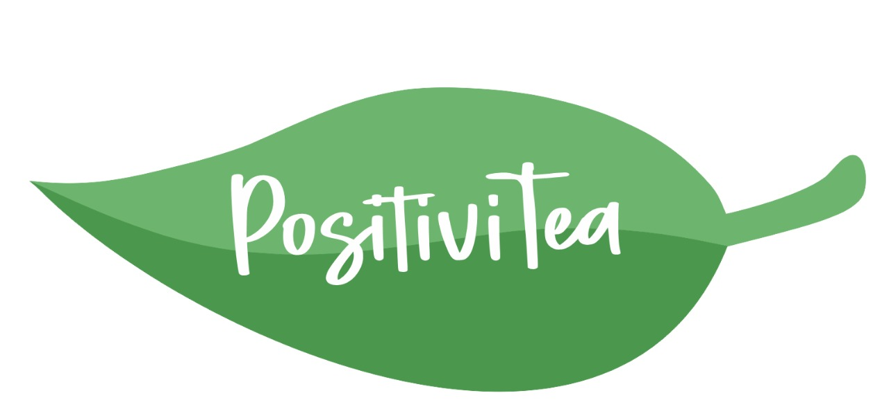

# PositiviTea
Proyecto "POSITIVITEA" a cargo del ```Grupo 2``` / Digital House

### Descripción del sitio
* PositiviTea es un Market Place de un negocio local dedicado a la venta de infusiones como té o cafe. Se podrán realizar ventas minoristas y mayoristas. 
El sitio web apunta a aquel público mayor de edad apasionado por las infusiones 

### Sitios de referencia
* Elegida por ser líder en el país en el hámbito del Ecommerce (Market Place)

[Mercado Libre](https://www.mercadolibre.com.ar/ "Ir a Mercado Libre")

* Sitios elegidos por la relacion con los productos que estaremos usando para el proyecto

[Dolce Gusto](https://www.dolce-gusto.com.ar/ "Ir a Dolce Gusto") /
[Tea Shop](https://www.teashopargentina.com.ar/ "Ir a Tea Shop") /
[Medialunas Calentitas](https://medialunaslarioja.com.ar/ "Ir a Medialunas Calentitas") /
[Freddo](https://freddo.com.ar/ "Ir a Freddo")

### Colores usados
* RGB => (109,180,110)
* RGB => (75,151,77)

### Tipografia
* Wishbone Tea
* Roboto (Google Fonts)

### Logo
*  

### Integrantes del equipo

```Mercado, Claudio```  
```Miller, Guillermo```  
```Miranda, Juan```  
```Toledo, María Inés```  

